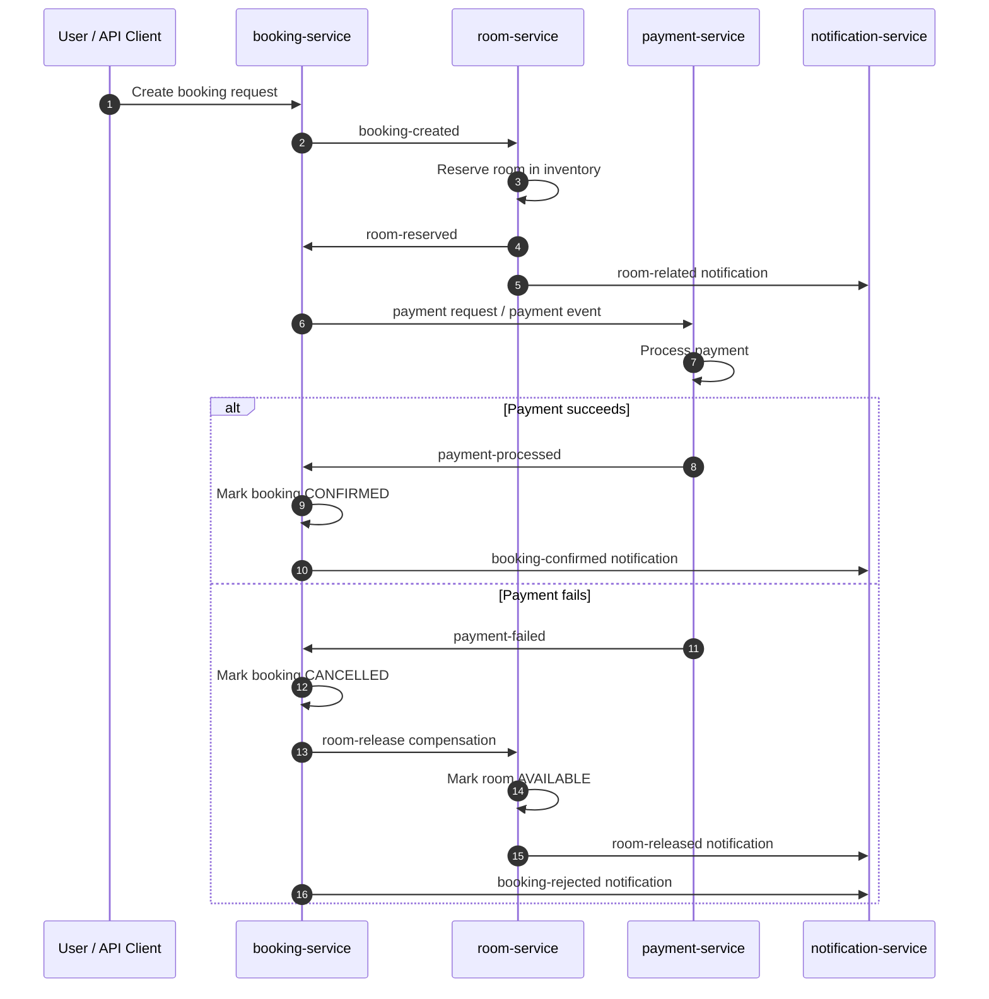

# Sample Room Booking Microservices

This project is a Spring Boot microservices demo for a hotel room booking saga. It shows how booking, room inventory, payment, and notification services coordinate through Kafka events and MySQL persistence.

## Purpose

The application demonstrates an end-to-end room booking workflow:

1. A booking is created in `booking-service`.
2. `room-service` reserves a room and publishes the reservation result.
3. `payment-service` processes the payment decision.
4. If payment succeeds, the booking is confirmed.
5. If payment fails, the booking is cancelled and the room is released back to available inventory.
6. `notification-service` records saga-related events for tracking and audit.

The repository is organized as a Maven multi-module project with these services:

- `booking-service` on port `8081`
- `room-service` on port `8082`
- `payment-service` on port `8083`
- `notification-service` for event handling and notifications

Supporting infrastructure is provided through Docker Compose:

- Kafka on `localhost:9092`
- Zookeeper on `localhost:2181`
- MySQL on `localhost:3306`

## Prerequisites

- Java 17
- Maven 3.8+
- Docker and Docker Compose

## Local Setup

Start the infrastructure first:

```bash
docker compose up -d
```

Then run each service from its module directory or from the repository root.

Run from the root with Maven:

```bash
mvn clean install
```

Run a single service:

```bash
cd booking-service
mvn spring-boot:run
```

Use the same command in `room-service` or `payment-service` to start those services.

## Usage

The typical flow is:

1. Create a booking through the booking API.
2. Watch Kafka events move the saga forward across the services.
3. If payment fails, the room is released automatically.

Suggested manual validation order:

1. Start Docker infrastructure.
2. Start all Spring Boot services.
3. Create a booking request.
4. Check the logs for `booking-created`, `room-reserved`, `payment-processed` or `payment-failed`, and `room-released`.

## Project Notes

- Kafka JSON listeners use type-specific container factories so each topic deserializes into the correct local event model.
- Flyway manages database migrations.
- MyBatis is used for persistence in the service modules.

## Saga Pattern

This project follows the saga pattern to coordinate a distributed booking transaction without a single shared database transaction.



The key idea is that each service completes its own local transaction and publishes the next event. When payment fails, `booking-service` sends a compensating `room-release` event so `room-service` can restore the inventory state.

## Documentation

If you need a quick overview of the system, start with this README and then inspect the service-level `application.properties` files for ports and Kafka settings.